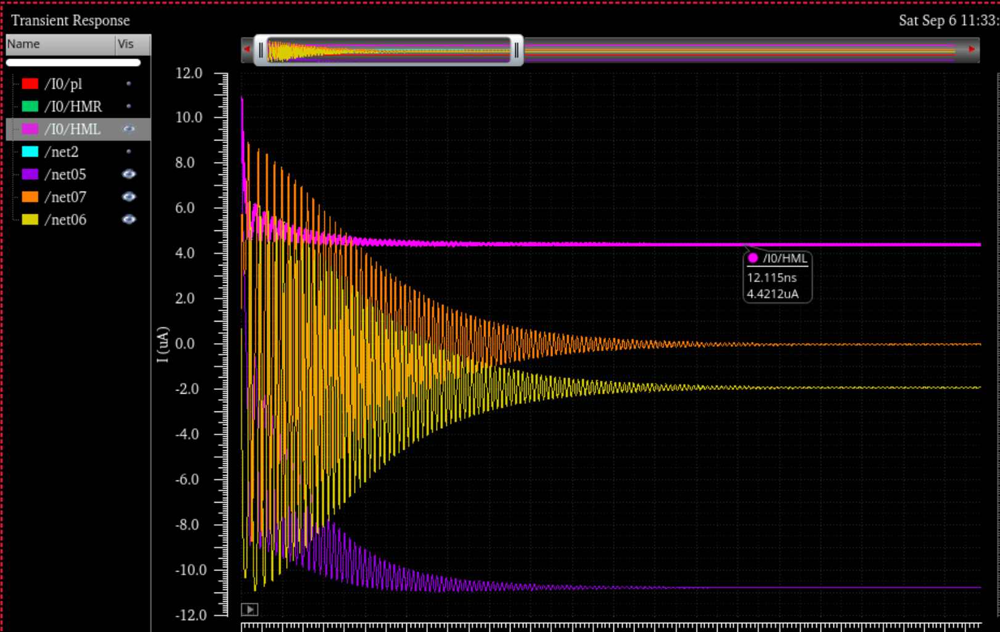

## SOT-MTJ
### System description

- It is a three terminal device 
- The free layer has perpendicular magnetization
- verilog-a code: EDA cluster -> /home/zhuzhf/code/project/MRAM2 -> **MRAM** library -> **SOT-zf** cell

### Default Parameters

| Name            | Value          | Name         | Value             |
| --------------- | -------------- | ------------ | ----------------- |
| M~s~            | 1000 emu/cm^3^ | R~p~         | 2kΩ               |
| α               | 0.01           | R~HM~        | 500Ω              |
| H~k~            | 1600 emu/cm3   | TMR          | 150%              |
| FL polarization | 0.4            | demag tensor | online calculated |
| θ~SH~           | −0.2           | θ~init~      | 5°                |
| σ               | (0,1,0)        |              |                   |

### Determine the sign of **θ**~sh~

  - According to the following code, **σ** = +**y** when **J**<sub>c</sub> &gt; 0 along +**x** direction and **J**<sub>s</sub> along +**z** direction


```verilog
    parameter real PSOT_x     = 0;              //spin flux polarization
    parameter real PSOT_y     = 1;
    parameter real PSOT_z     = 0;
```

- Following $\mathbf{J}_\mathrm{s}=\theta_{sh}\mathbf{σ} \times \mathbf{J}_\mathrm{c}$, one can get that **θ**~sh~<0 
### Determine the switching direction

- As shown in the verification section, we apply **H**<sub>x</sub> = −**x**
- According to Δ**m**=**m**x(**m**x**σ**), one can get $\Delta{\mathbf{m}}=-\mathbf{y}$
- According to **L**=Δ**m**x**H**~x~, one can get **L** = −**z**, therefore, the magnetization is switched from up to down, which will be verified in the simulation.
  

### Verify SOT switching[^SOT-verification]

- By changing the following parameters, SOT switching identical to matlab simulation [^SOT-matlab] is obtained

  - ```verilog
    parameter real Hk    = 1.5;
    parameter real hext_x = -100e-3;
    ```
    
1. Virtuoso setups and results
   
    
    
    
  - The waveform shows I<sub>HM</sub> = 4.42 μA, converting into current density is 4.0182e11 A/m^2^, which is used in the matlab simulation for benchmarking.
2. Comparison between matlab and verilog-a


### Basic SOT characteristics[^basic SOT]

**Sweeping Jc**


**Sweeping Hx**

## STT verification


## References

[^SOT]: OneDrive\code_softwares\ODE\LLG_integral\sample_updated\SOT_test

[^SOT-verification]: EDA cluster -> /home/zhuzhf/code/project/MRAM2 -> **MRAM** library -> **MTJzf_tb** cell
