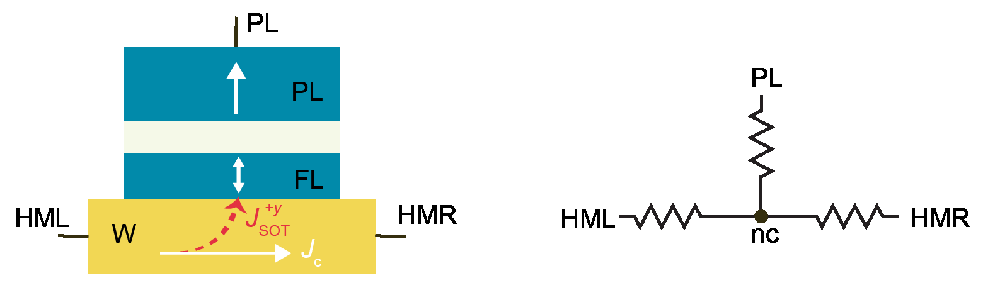
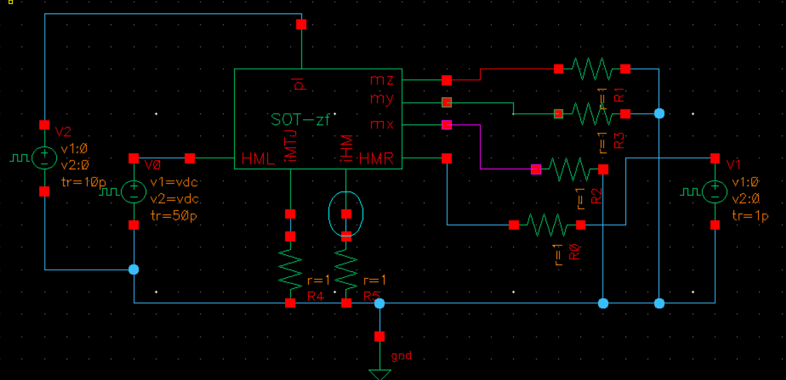
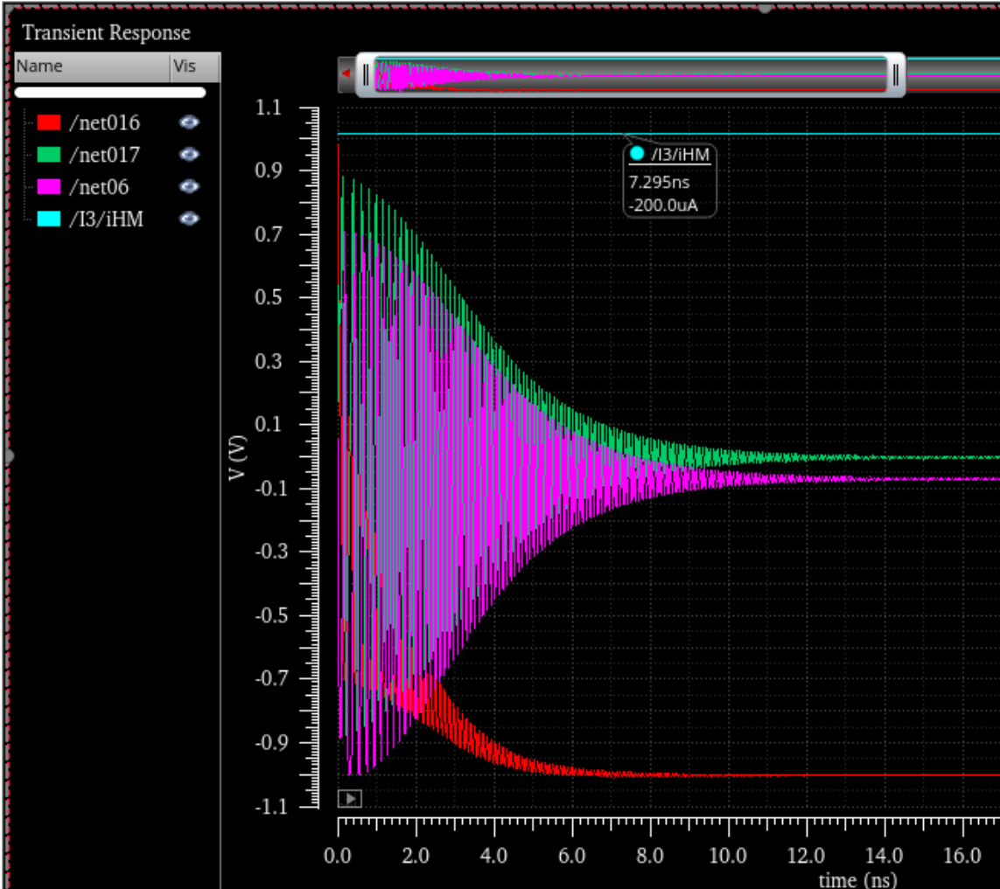
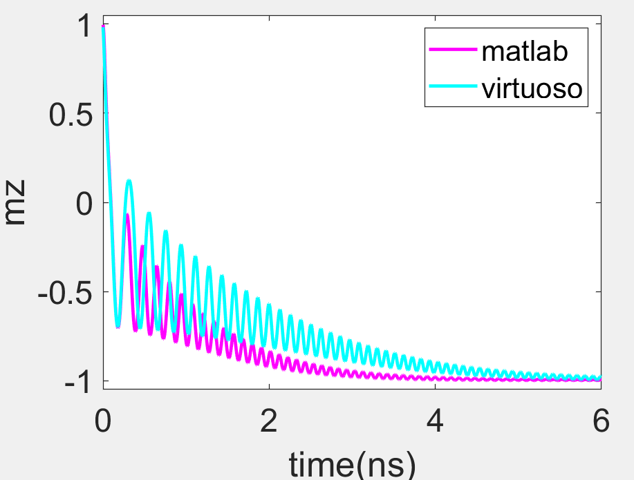
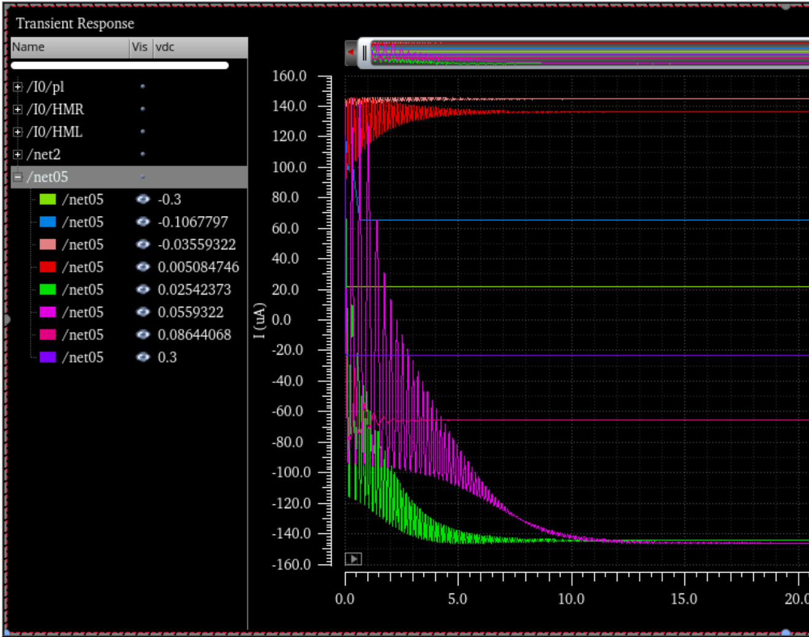

## SOT-MTJ
### System description

- It is a three terminal device 
- The free layer has perpendicular magnetization
- verilog-a code: EDA cluster -> /home/zhuzhf/code/project/MRAM2 -> **MRAM** library -> **SOT-zf** cell

### Resistor network

- The device structure and its corresponding resistor network is shown below.



### Default Parameters

| Name                     | Value          | Name                     | Value             |
| ------------------------ | -------------- | ------------------------ | ----------------- |
| M~s~                     | 1000 emu/cm^3^ | R~p~                     | 2kΩ               |
| α                        | 0.01           | ρ~HM~                    | 200e-8 Ω.m        |
| H~k~                     | 1.5 T          | TMR                      | 150%              |
| FL polarization          | 0.4            | demag tensor             | online calculated |
| θ~SH~                    | −0.3           | θ~init~                  | 5°                |
| σ                        | (0,1,0)        | Temperature              | 0 K               |
| L~FL~, W~FL~, t~FL~ (nm) | 50, 50, 1.2    | L~HM~, W~HM~, t~HM~ (nm) | 55, 55, 4         |

**Discussions**

- Based on Nat. Mater. **9**, 721 (2010)., H~an~ = 2(K~bulk~ + K~i~/t~FL~)/M~s~ with K~bulk~ = 2.245 × 10^5^ J/m^3^, K~i~ = 1.286 × 10^−3^ J/m^2^, M~s~ = 1.58 T=1257 emu/cm^3^, when we use t~FL~ = 1.2nm, it gives H~an~ = 2.06 T. Here we approximate M~s~ = 1000 emu/cm^3^, H~k~ = 1.5 T.
- Ta = 190 µΩ.cm [2012-Science-Luqiao Liu], W = 260 µΩ.cm or 170 µΩ.cm [2012-APL-Chi-Feng Pai], we approximate ρ~HM~=200e-8 Ω.m.

### Determine the sign of **θ**~sh~

  - According to the following code, **σ** = +**y** when **J**<sub>c</sub> &gt; 0 along +**x** direction and **J**<sub>s</sub> along +**z** direction


```verilog
    parameter real PSOT_x     = 0;              //spin flux polarization
    parameter real PSOT_y     = 1;
    parameter real PSOT_z     = 0;
```

- Following $\mathbf{J}_\mathrm{s}=\theta_{sh}\mathbf{σ} \times \mathbf{J}_\mathrm{c}$, one can get that **θ**~sh~<0 
### Determine the switching direction

- As shown in the verification section, we apply **H**<sub>x</sub> = −**x**
- According to Δ**m**=**m**x(**m**x**σ**), one can get $\Delta{\mathbf{m}}=-\mathbf{y}$
- According to **L**=Δ**m**x**H**~x~, one can get **L** = −**z**, therefore, the magnetization is switched from up to down, which will be verified in the simulation.
  

### Verify SOT switching[^SOT-verification]

- By changing the following parameters, SOT switching identical to matlab simulation [^SOT-matlab] is obtained

  - ```verilog
    parameter real hext_x = -100e-3;
    ```
    
1. Virtuoso setups and results, where vdc is 100 mV
   
    
    
    
  - Based on R~HM~=ρ~HM~xL~HM~/(W~HM~xt~HM~)=500Ω. The waveform shows that we get the correct I~HM~ =100mV/500Ω= 200 μA. Converting into current density is 100mV/500Ω/(55e-9x4e-9)=9.09e11 A/m^2^, which is used in the matlab simulation for benchmarking.
2. Comparison between matlab and verilog-a



### Basic SOT characteristics[^basic SOT]

**Sweeping Jc**



**Sweeping Hx**

## STT verification


## References

[^SOT]: OneDrive\code_softwares\ODE\LLG_integral\sample_updated\SOT_test

[^SOT-verification]: EDA cluster -> /home/zhuzhf/code/project/MRAM2 -> **MRAM** library -> **MTJzf_tb** cell
