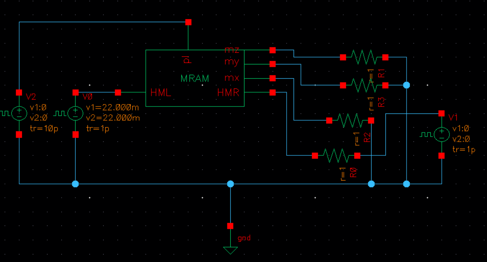
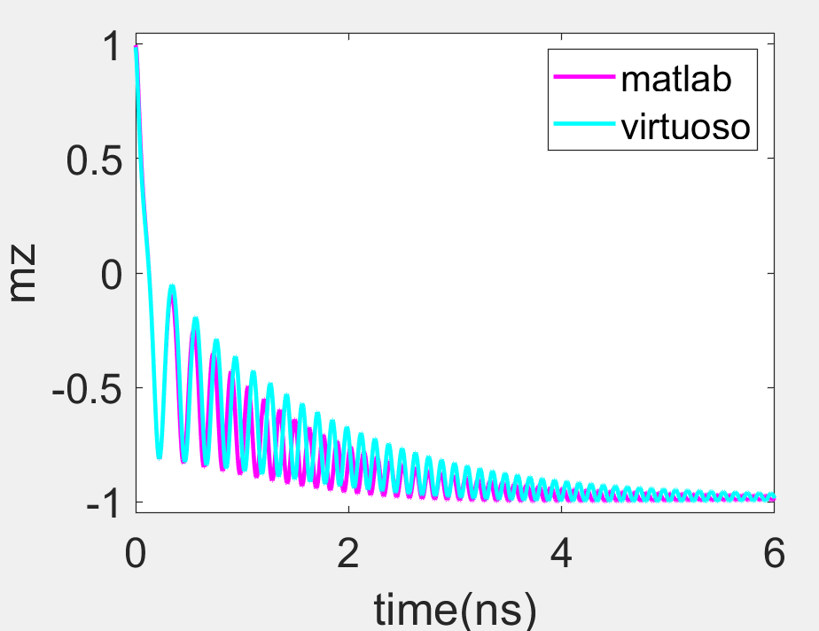

## SOT verification
### System description

- It is a three terminal device 
- The free layer has perpendicular magnetization
### Determine the sign of **θ**<sub>sh</sub>
  - According to the following code, **σ** = +**y** when **J**<sub>c</sub> &gt; 0 along +**x** direction and **J**<sub>s</sub> along +**z** direction


```verilog
    parameter real PSOT_x     = 0;              //spin flux polarization
    parameter real PSOT_y     = 1;
    parameter real PSOT_z     = 0;
```

- Following $\mathbf{J}_\mathrm{s}=\theta_{sh}\mathbf{σ} \times \mathbf{J}_\mathrm{c}$, one can determine **$\mathbf{θ}_{sh}<0$** 
### Determine the switching direction

- As shown in the verification section, we apply $\mathbf{H}_x =-\mathbf{x}$

- According to 
  
  ```math
    \Delta{\mathbf{m}}=\mathbf{m}\times({\mathbf{m}}\times{\mathbf{σ}}),
  ```
  
  one can get $\Delta{\mathbf{m}}=-\mathbf{y}$
  
- According to 
  
  ```math
  \mathbf{L}=\Delta{\mathbf{m}}\times\mathbf{H}_x,
  ```
  
  one can get $\mathbf{L}=-\mathbf{z}$, therefore, the magnetization is switched from up to down, which will be verified in the simulation.

### Verification

- By change the following settings, SOT switching is achieved and identical to matlab simulation

  - ```verilog
    parameter real Hk    = 1.5;
    parameter real hext_x = -100e-3;
    ```
    
  - Virtuoso setups

    

  - Comparison between matlab and verilog-a

    


## STT verification

