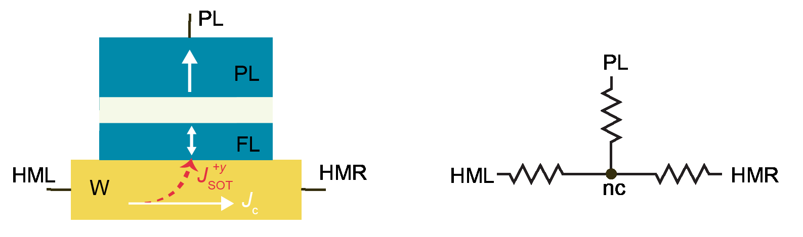
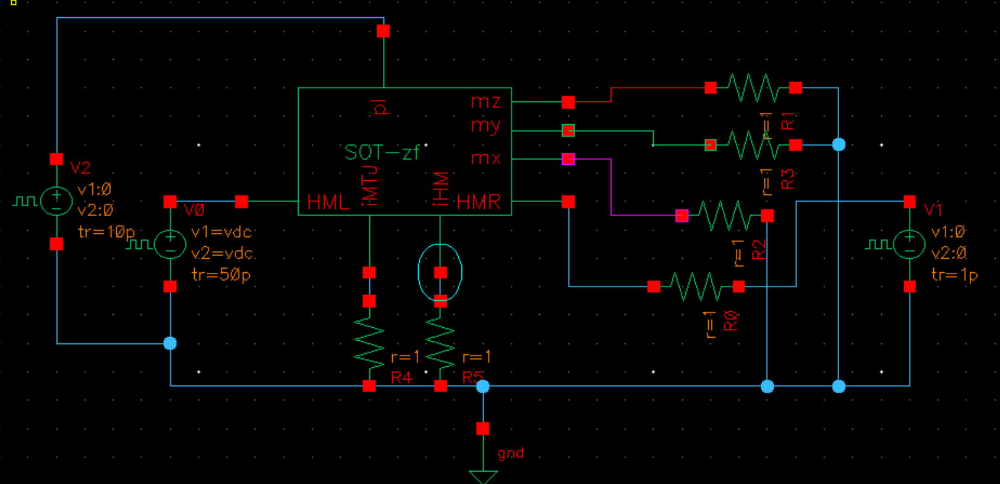
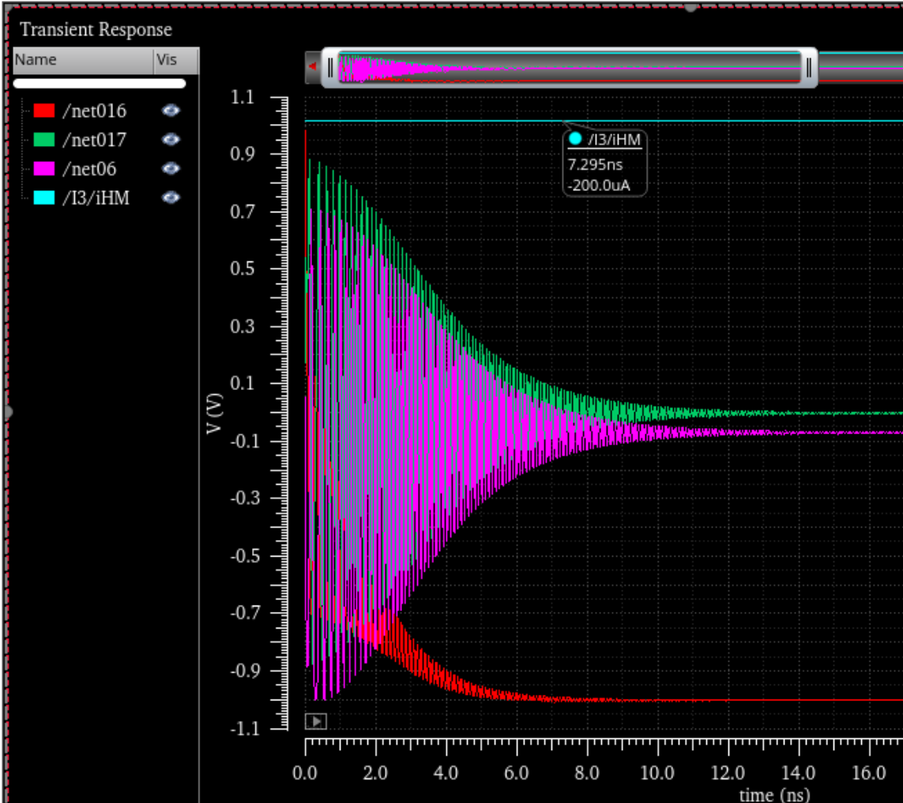
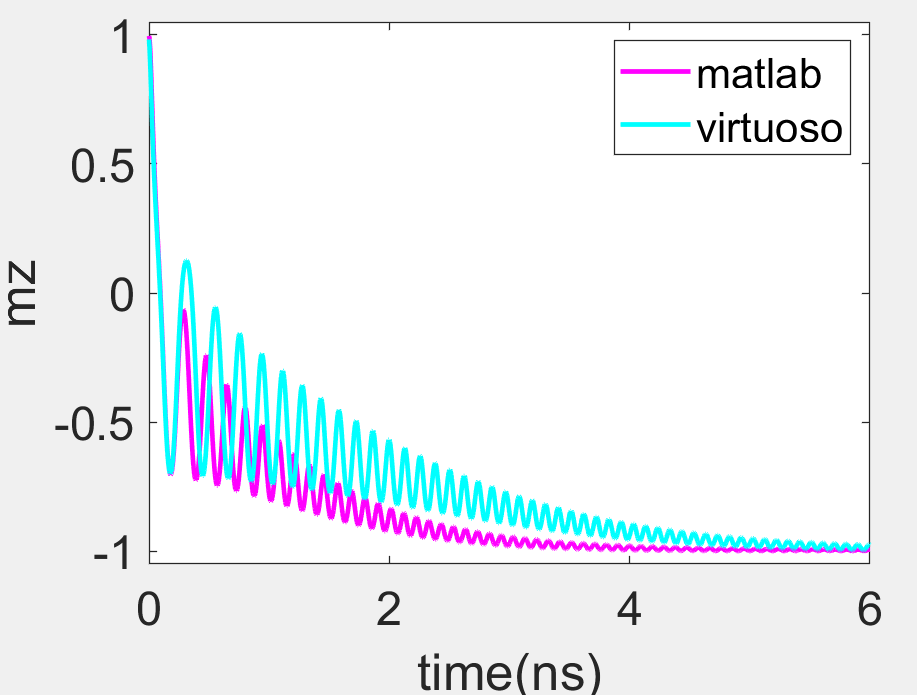
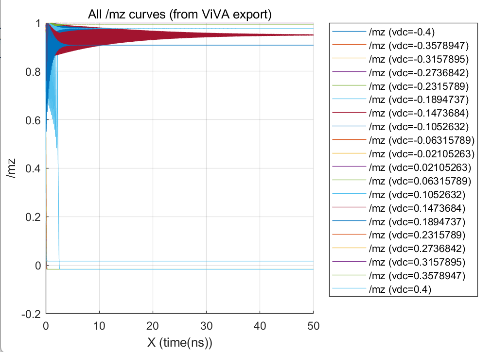
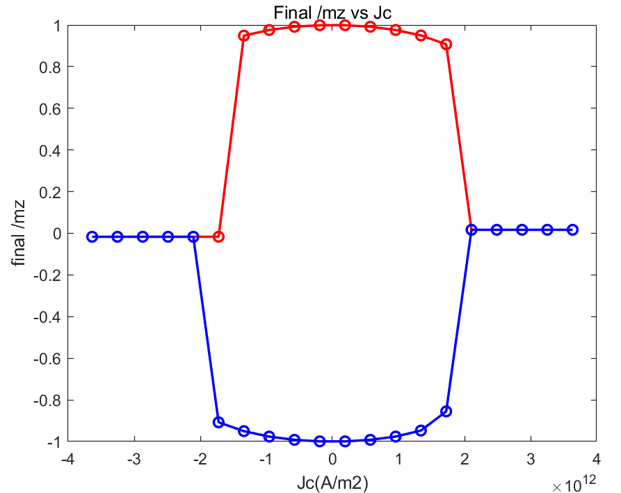
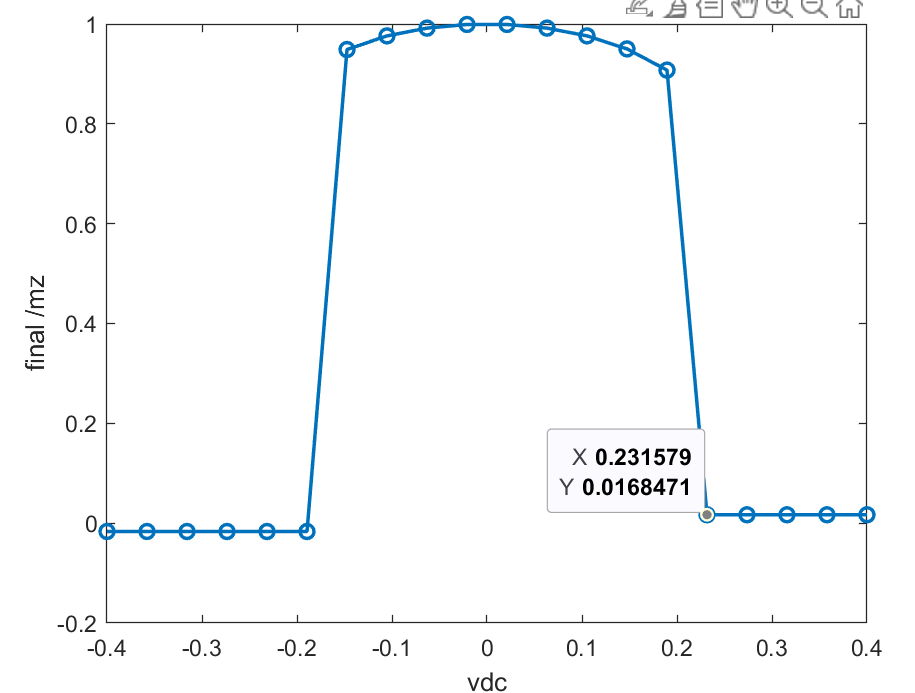
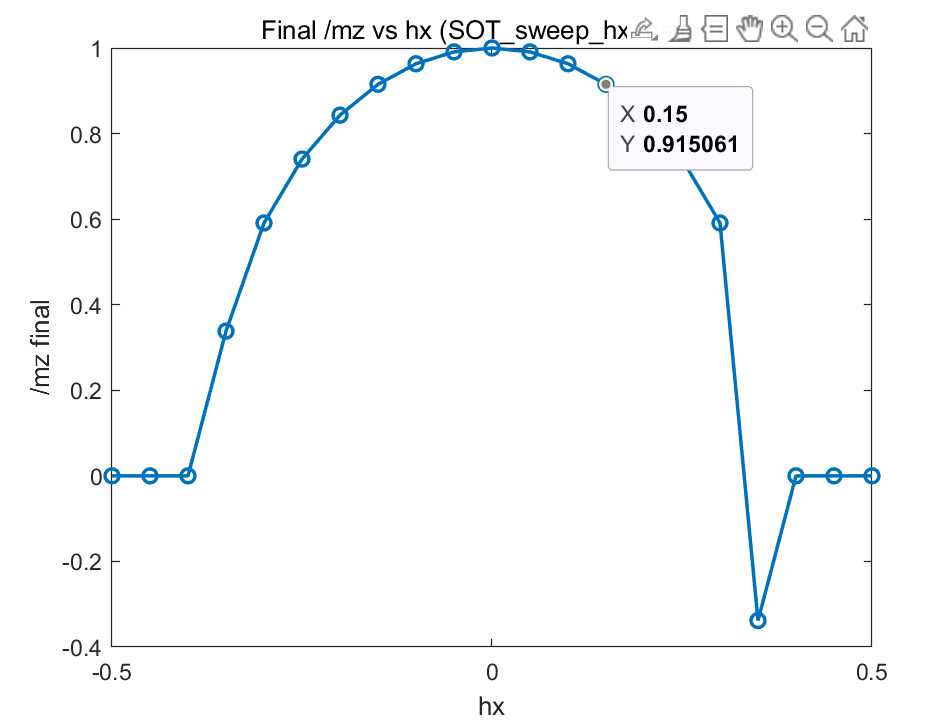

## SOT-MTJ
### System description

- It is a three terminal device 
- The free layer has perpendicular magnetization
- verilog-a code: EDA cluster -> /home/zhuzhf/code/project/MRAM2 -> **MRAM** library -> **SOT-zf** cell

### Resistor network

- The device structure and its corresponding resistor network is shown below.



### Default Parameters

| Name                     | Value          | Name                     | Value             |
| ------------------------ | -------------- | ------------------------ | ----------------- |
| M<sub>s</sub>                     | 1000 emu/cm<sup>3</sup> | R<sub>p</sub>                     | 2kΩ               |
| α                        | 0.01           | ρ<sub>HM</sub>                    | 200e-8 Ω.m        |
| H<sub>k</sub>                     | 1.5 T          | TMR                      | 150%              |
| FL polarization          | 0.4            | demag tensor             | online calculated |
| θ<sub>SH</sub>                    | −0.3           | θ<sub>init</sub>                  | 5°                |
| σ                        | (0,1,0)        | Temperature              | 0 K               |
| L<sub>FL</sub>, W<sub>FL</sub>, t<sub>FL</sub> (nm) | 50, 50, 1.2    | L<sub>HM</sub>, W<sub>HM</sub>, t<sub>HM</sub> (nm) | 55, 55, 4         |

**Discussions**

- Based on Nat. Mater. **9**, 721 (2010)., H<sub>an</sub> = 2(K<sub>bulk</sub> + K<sub>i</sub>/t<sub>FL</sub>)/M<sub>s</sub> with K<sub>bulk</sub> = 2.245 × 10<sup>5</sup> J/m<sup>3</sup>, K<sub>i</sub> = 1.286 × 10<sup>−3</sup> J/m<sup>2</sup>, M<sub>s</sub> = 1.58 T=1257 emu/cm<sup>3</sup>, when we use t<sub>FL</sub> = 1.2nm, it gives H<sub>an</sub> = 2.06 T. Here we approximate M<sub>s</sub> = 1000 emu/cm<sup>3</sup>, H<sub>k</sub> = 1.5 T.
- Ta = 190 µΩ.cm [2012-Science-Luqiao Liu], W = 260 µΩ.cm or 170 µΩ.cm [2012-APL-Chi-Feng Pai], we approximate ρ<sub>HM</sub>=200e-8 Ω.m.

### Determine the sign of **θ**<sub>SH</sub>

  - According to the following code, **σ** = +**y** when **J**<sub>c</sub> &gt; 0 along +**x** direction and **J**<sub>s</sub> along +**z** direction


```verilog
    parameter real PSOT_x     = 0;              //spin flux polarization
    parameter real PSOT_y     = 1;
    parameter real PSOT_z     = 0;
```

- Following $\mathbf{J}_\mathrm{s}=\theta_{sh}\mathbf{σ} \times \mathbf{J}_\mathrm{c}$, one can get that **θ**<sub>SH</sub> &lt; 0
### Determine the switching direction

- As shown in the verification section, we apply **H**<sub>x</sub> = −**x**
- According to Δ**m**=**m**x(**m**x**σ**), one can get $\Delta{\mathbf{m}}=-\mathbf{y}$
- According to **L**=Δ**m**x**H**<sub>x</sub>, one can get **L** = −**z**, therefore, the magnetization is switched from up to down, which will be verified in the simulation.
  

### Verify SOT switching[^SOT-verification]

- By changing the following parameters, SOT switching identical to matlab simulation [^SOT-matlab] is obtained

  - ```verilog
    parameter real hext_x = -100e-3;
    ```
    
1. Virtuoso setups and results, where vdc is 100 mV
   
    
    
    
  - Based on R<sub>HM</sub>=ρ<sub>HM</sub>xL<sub>HM</sub>/(W<sub>HM</sub>xt<sub>HM</sub>)=500Ω. The waveform shows that we get the correct I<sub>HM</sub> =100mV/500Ω= 200 μA. Converting into current density is 100mV/500Ω/(55e-9x4e-9)=9.09e11 A/m<sup>2</sup>, which is used in the matlab simulation for benchmarking.
2. Comparison between matlab and verilog-a



### Basic SOT characteristics[^basic SOT]

**Sweeping J<sub>c</sub>**

- Based on the following result, we know vdc should be limited below 0.23 V, corresponding to J<sub>c</sub> &lt; 2e12 A/m<sup>2</sup>.





**Sweeping H<sub>x</sub>**

Based on the following result, we know **H**<sub>x</sub> should be limited below 0.15 T.



## STT verification


## References

[^SOT]: OneDrive\code_softwares\ODE\LLG_integral\sample_updated\SOT_test

[^SOT-verification]: EDA cluster -> /home/zhuzhf/code/project/MRAM2 -> **MRAM** library -> **MTJzf_tb** cell
